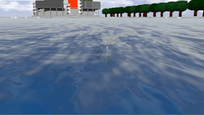

# Paper: Theory, simulations, and experiments of path following guidance strategies for autonomous robotic vehicles: Part I
This repository implements a simulation playground for performing path following experiments with the Medusa clas of marine vehicles. It implements the algorithms described in the survey paper "Theory, simulations, and experiments of path following guidance strategies for autonomous robotic vehicles: Part I".

The equivalent matlab control toolbox developed in the scope of this paper is available at [Github Matlab-toolbox](https://github.com/hungrepo/path-following-Matlab/tree/master/PF-toolbox).


<p align = "center">

</p>

### Ackowledgment
If you are using this code research and development for your publication, please cite:

```
@inproceedings{Hung_tuan,
	doi = {},
	url = {},
	year = 2022,
	month = {},
	publisher = {{}},
	author = {Hung Tuan and Francisco Rego and Joao Quintas and Joao Cruz and Marcelo Jacinto and David Souto and André Potes and Luis Sebastião and António Pascoal},
	title = {Theory, simulations, and experiments of path following guidance strategies for autonomous robotic vehicles},
	booktitle = {}
}
```

### Requirements
This code stack was developed with ROS1 in mind. In order to use, you are required to have:
- Ubuntu 20.04LTS (64-bit)
- ROS1 Noetic
- Python 3

This repository assumes that you already have a machine running ubuntu 20.04LTS and a working installation of ROS1 (Noetic) and Gazebo 11. If you do not have ROS installed, please follow the steps available at the [ROS installation guide](http://wiki.ros.org/noetic/Installation/Ubuntu).

### Setup the ROS workspace
Running the following commands will clone this repository and setup a clean ROS workspace
```
cd ${HOME} && \
git clone --recursive git@github.com:dsor-isr/medusa_base.git catkin_ws_paper/src
```

Run the following lines to add required environment variable to your .bashrc file
```
echo "source /opt/ros/noetic/setup.bash" >> ~/.bashrc
echo "export CATKIN_ROOT=${HOME}" >> ~/.bashrc
echo "export ROS_WORKSPACE=${CATKIN_ROOT}/catkin_ws_paper" >> ~/.bashrc
echo "export MEDUSA_SCRIPTS=$(find ${ROS_WORKSPACE}/src/ -type d -iname medusa_scripts | head -n 1)
echo "source ${ROS_WORKSPACE}/devel/setup.bash" >> ~/.bashrc" 
```

### Installing library requirements and compiling the code
Run the following bash script to install external library requirements:
```
bash ./install_script.sh
```

Source your bashrc file and compile the code
```
source ~/.bashrc
catkin build
```

### Run a simulation experiment

- Start the 3D gazebo simulation along with all the control and navigation algorithms. The 2 supported vehicles in this demo are 'myellow' and 'mvector'. The latter can be actuated in 'surge', 'sway' and 'yaw/yaw-rate', while the 'myellow' vehicle can only be controlled in 'surge' and 'yaw/yaw-rate'. If gazebo visual mode is too heavy, you can disable the 3D simulation gui 🤓!
```
roslaunch experiments_bringup start_gazebo_simulation.launch name:=myellow gui:=true
```

- Start a pre-defined path following mission. The name of the vehicle must match the previous one. The supported paths in this demo are 'bernoulli' and 'lawn_mower'.
```
roslaunch experiments_bringup start_mission.launch name:=myellow path_type:=bernoulli controller_type:=aguiar
```

<Summary>Supported Vehicles:</Summary>
<details>
	<ul>
		<li>myellow</li>
		<li>mvector</li>
	</ul>
</details>

<Summary>Supported Controllers:</Summary>
<details>
	<ul>
		<li>samson (method 1)</li>
		<li>lapierre (method 2)</li>
		<li>fossen (method 3)</li>
		<li>brevik (method 4)</li>
		<li>aguiar (method 6)</li>
		<li>romulo (method 6, but control surge and sway and leaves yaw as degree of freedom)</li>
		<li>relative_heading (method 6, but we can specify the heading relative to the tagent to the path)</li>
		<li>pramod (like fossen, but with integral term)</li>
	</ul>
</details>

<Summary>Supported Paths:</Summary>
<details>
	<ul>
		<li>bernoulli</li>
		<li>lawn_mower</li>
	</ul>
</details>

Note: If running the last command does not seem to work, check if the vehicle name selected is the same as the one in the first launch command.

### Implementation Structure
The C++ code that implements the controllers logic can be found at the package:
```
medusa_base/medusa_control/outer_loops_controllers/path_following
```

The C++ code that implements the paths equations can be found at the package:
```
medusa_base/medusa_planning/dsor_paths
```

### Literature Revision and Theoretical Overview
- Hung Tuan <nguyen.hung@tecnico.ulisboa.pt>
- Francisco Rego <ffcrego@gmail.com>
- Marcelo Jacinto <marcelo.jacinto@tecnico.ulisboa.pt>
- Professor António Pascoal <antonio@isr.tecnico.ulisboa.pt>

### Path Following Coders
- Marcelo Jacinto <marcelo.jacinto@tecnico.ulisboa.pt>
- Hung Tuan <nguyen.hung@tecnico.ulisboa.pt>
- João Quintas <jquintas@gmail.com>
- João Cruz <joao.pedro.cruz@tecnico.ulisboa.pt>
- David Souto <david.souto@tecnico.ulisboa.pt>
- André Potes <andre.potes@gmail.com>

### Mechanics for Water Trials with the Real Vehicles
- Luis Sebastião

### License
This repository is open-sourced under the MIT license. See the [LICENSE](LICENSE) file for details.
